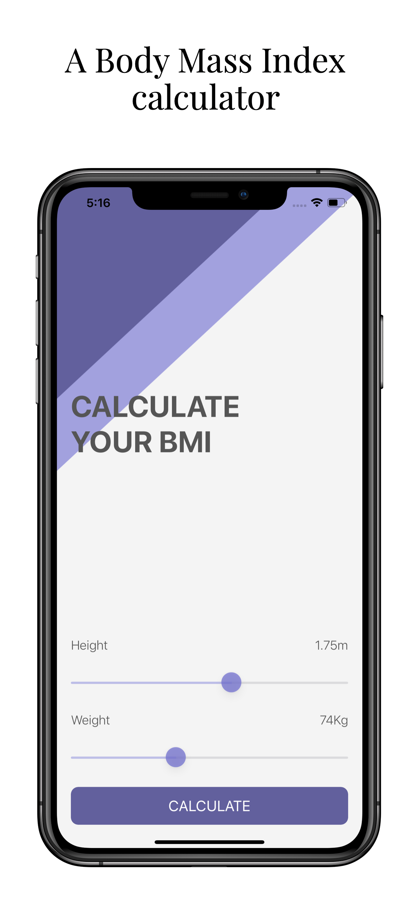
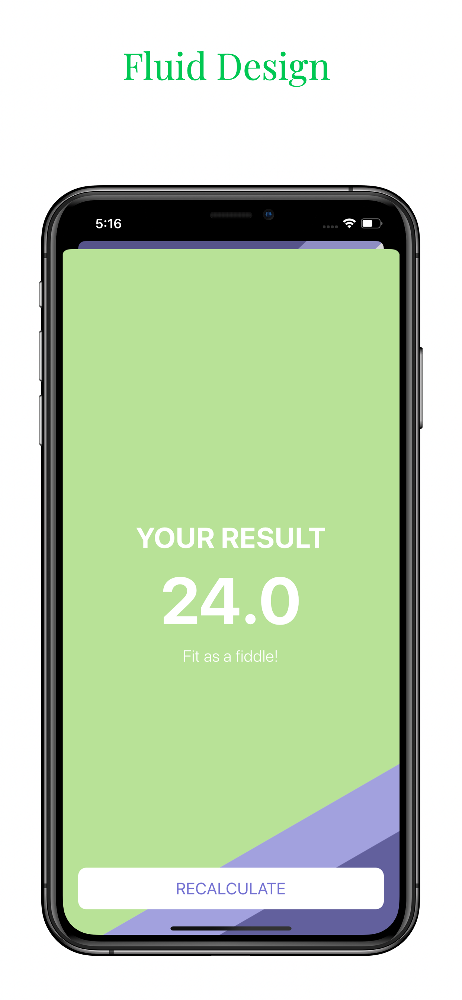
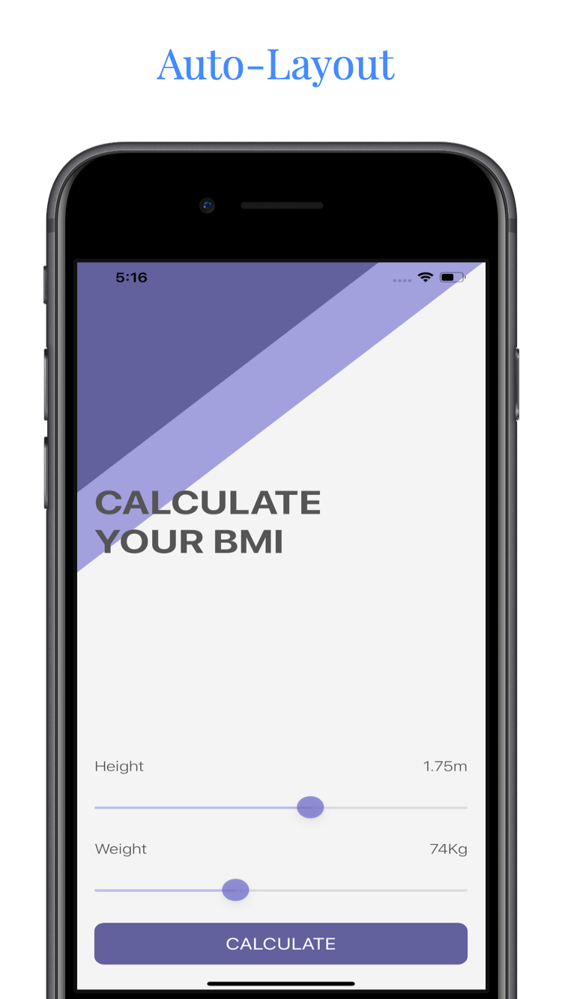

#  Weight Checker
A Body Mass Index calculator. Based on the user’s weight and height it will calculate their body mass and give a piece of health advice depending on whether if they have eaten too many pies or if they need to eat more pies.

# Technologies used
- Xcode
- Swift
- Storyboards and progmattic UI
- MVC Design Pattern
- UIKit
- AutoLayout
-Segues and Navigation

# Screenshots

